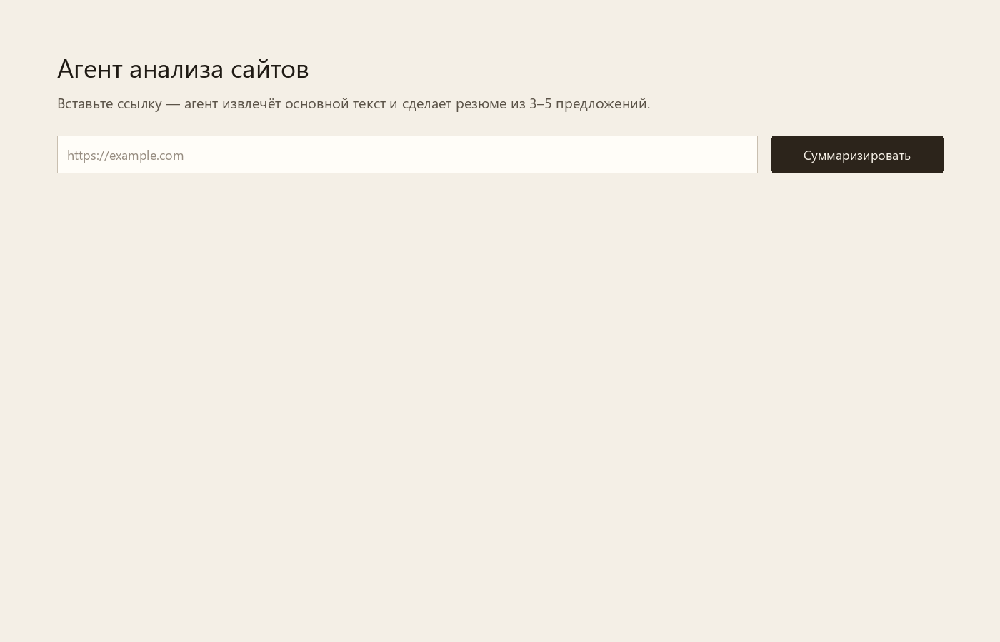
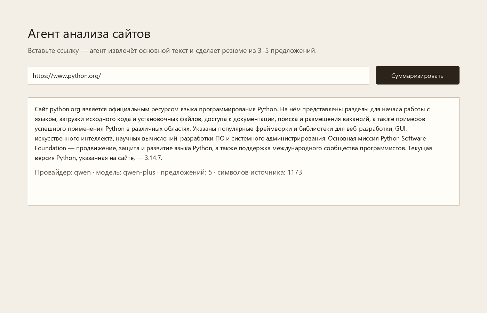
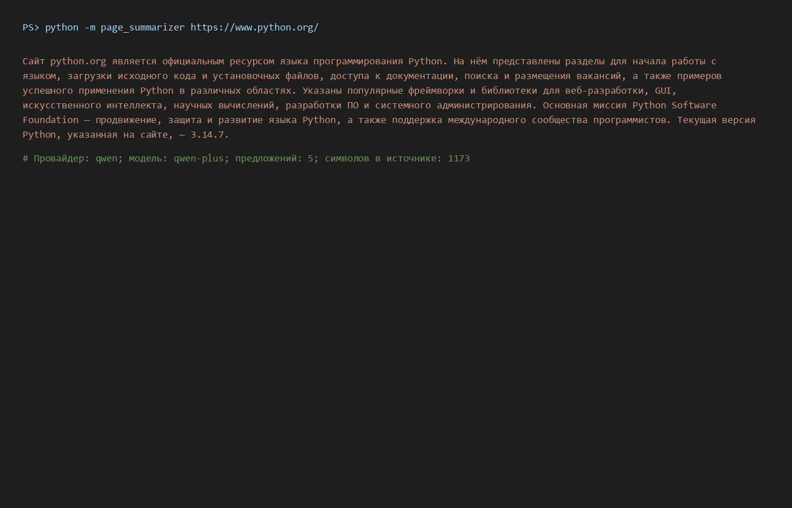

# Демонстрация работоспособности

Требование задания: *«Для демонстрации работоспособности также прикрепи скриншоты, видео работы проекта или ссылку на работающий проект.»*

## Ссылка на проект

Репозиторий GitHub: https://github.com/profcom2-cpu/page-summarizer-agent

Локальный запуск веб-интерфейса: http://127.0.0.1:8020

## Скриншоты

### 1. Веб-интерфейс до запроса



### 2. Результат анализа https://www.python.org/



Живой ответ агента 12.09.2026:

> Сайт python.org является официальным ресурсом языка программирования Python. На нём представлены разделы для начала работы с языком, загрузки исходного кода и установочных файлов, доступа к документации, поиска и размещения вакансий, а также примеров успешного применения Python в различных областях. Указаны популярные фреймворки и библиотеки для веб-разработки, GUI, искусственного интеллекта, научных вычислений, разработки ПО и системного администрирования. Основная миссия Python Software Foundation — продвижение, защита и развитие языка Python, а также поддержка международного сообщества программистов. Текущая версия Python, указанная на сайте, — 3.14.7.

Метаданные: провайдер `qwen`, модель `qwen-plus`, **5 предложений**, 1173 символа исходного текста.

Сохранённый HTML того же ответа: [02-web-result.html](02-web-result.html)

Короткое видео-демо (GIF: форма → результат):


### 3. Командная строка



```powershell
python -m page_summarizer https://www.python.org/
```

## Как повторить

```powershell
cd "C:\Users\profc\Desktop\итоговый агент"
.\.venv\Scripts\Activate.ps1
python -m page_summarizer https://www.python.org/
uvicorn page_summarizer.web:app --host 127.0.0.1 --port 8020
```
